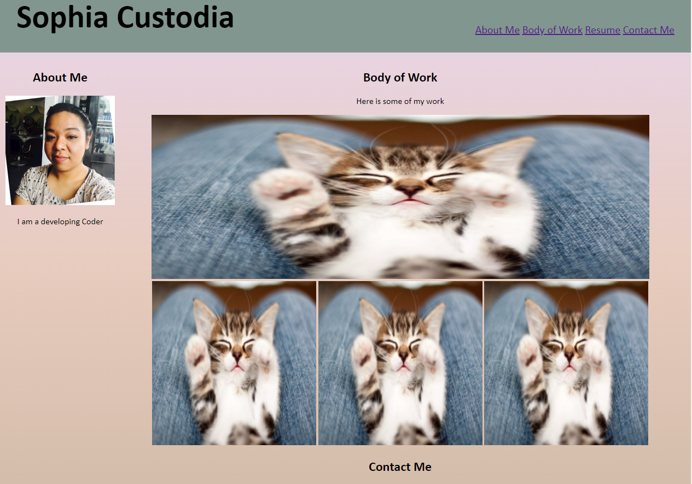

# myPortfolio

## Welcome Potential Employers 

This is my developer portfolio, Sophia Custodia. It showcases my recent projects and links for potential employers to try out. I also includes my resume, contact information, and my photo. 

The technology used was HTML and advanced CSS, utilizing flexboxes. Html was used to build the basic outline of my portfolio, the document includes semantic HTML and detailed content within. The HTML document is linked to a reset.css and a style.css. The purpose for the reset.css is to reset any browsers default css elements, allowing any browser to style according to the included style.css. 
Css was used to style my portfolio. Css selectors were used to incorporate a universal color palette and font styling. I used flexboxes to organize content within the INDEX.HTML and create a more dynamic feel to the page.
Media queries  were used to ensure my portfolio displays well on smaller screens.  
My greatest challenge while building this project was the flexboxes and playing with their layout. I hope to implement more in the future. Perseverance payed off and I am pleased with what I have to provide you; a launchpad to future my new career as a full stack developer!

[My Portfolio](https://sophtron5000.github.io/myPortfolio/)

## Features

* Semantic HTML elements
* Css styling and flexboxes
* Web Development Projects

## Table of Contents

* [Usage](#usage)
* [Credits](#credits)
* [License](#license)

## Usage 

For employment purposes only.

## Credits

Sophia Custodia
[Linkedin](https://www.linkedin.com/in/sophia-custodia/)

[w3School](https://w3schools.com/)

## License

Copyright (c) [2022] [SophiaCustodia]

Permission is hereby granted, free of charge, to any person obtaining a copy
of this software and associated documentation files (the "Software"), to deal
in the Software without restriction, including without limitation the rights
to use, copy, modify, merge, publish, distribute, sublicense, and/or sell
copies of the Software, and to permit persons to whom the Software is
furnished to do so, subject to the following conditions:

The above copyright notice and this permission notice shall be included in all
copies or substantial portions of the Software.

THE SOFTWARE IS PROVIDED "AS IS", WITHOUT WARRANTY OF ANY KIND, EXPRESS OR
IMPLIED, INCLUDING BUT NOT LIMITED TO THE WARRANTIES OF MERCHANTABILITY,
FITNESS FOR A PARTICULAR PURPOSE AND NONINFRINGEMENT. IN NO EVENT SHALL THE
AUTHORS OR COPYRIGHT HOLDERS BE LIABLE FOR ANY CLAIM, DAMAGES OR OTHER
LIABILITY, WHETHER IN AN ACTION OF CONTRACT, TORT OR OTHERWISE, ARISING FROM,
OUT OF OR IN CONNECTION WITH THE SOFTWARE OR THE USE OR OTHER DEALINGS IN THE
SOFTWARE.

